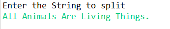
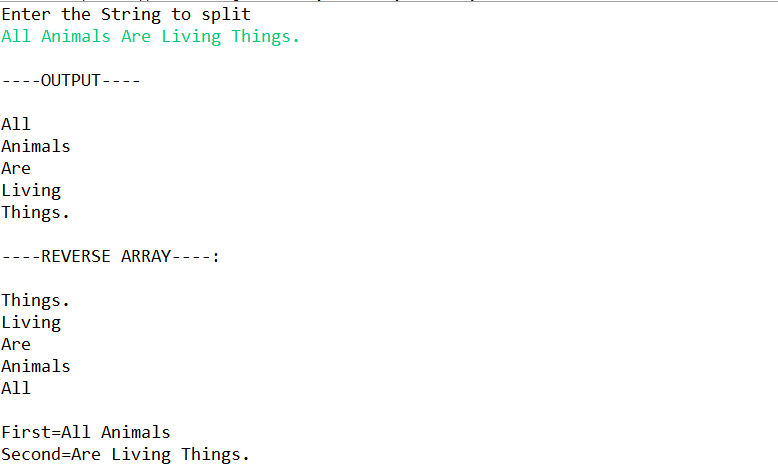

# SPLIT PROGRAM #

## Table of content ##

- Description
- Input String
- Output

---
### Description ###
- Split method is used for splitting a String into its substrings based on the given  expression.

- split Program link [Program](https://github.com/Mahesh3196/Programs/blob/split/Split/Split.java)

### INPUT

### OUTPUT

